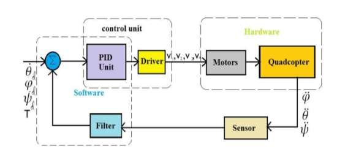

## THIS IS THE IMPLEMENTATION OF A FLIGHT CONTROLLER ON A TEENSY 4.1 MICROCONTROLLER BOARD
-Brief explanation of filesystems:-

 - the src directory contains all the necessary headers for control loop, PID, Kalman filter and sensor files
 - the autopilot.ino strings together all these files in a sensible order (given in the loop) and then publishes output to Motors
 - Motors controls the rotation velocity of the motors of quadcopter.
 - Calibrate file checks all the sensors at periodic intervals and logs the flight data.

Current Progress PID file almost complete, need to properly format the output,
need to tune EKF and add sensor isolation and input filtering simultaneously 

##CONNECTIONS :-
    Since we are using SPI communication, connections will be made accordingly. Current code is set for the following config:-
        - CS - pin number 10
        - SDI - pin number 11
        - SDO - pin number 12
        - SCK - pin number 13
        - Vin - 5V pin
        - 3V3 - 3.3V pin
        - GND - Ground pin 
    In the latest code push, I messed up the pins, so I will have to check the pin numbers all again.
